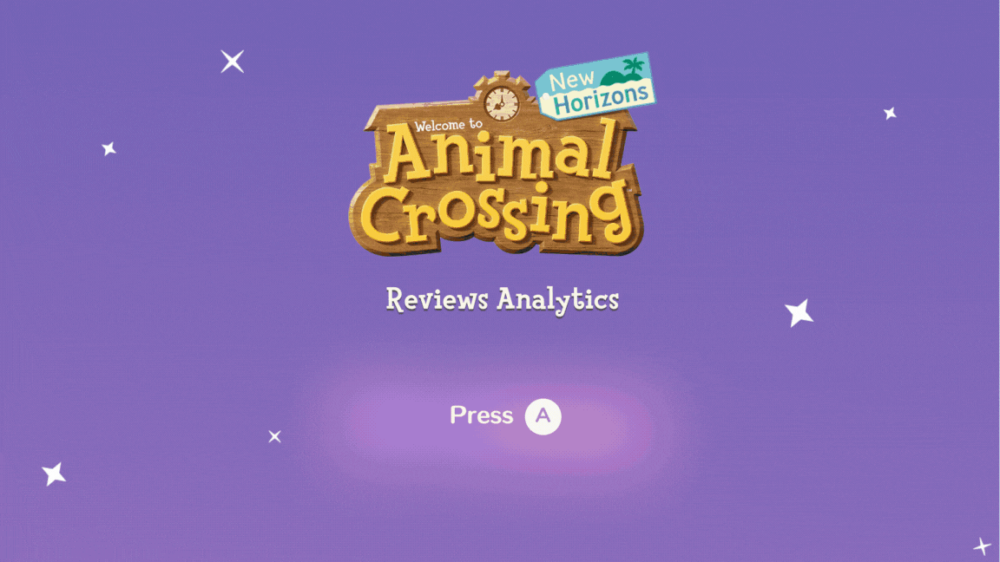

# Power BI Portfolio 📊

This repository serves as a professional Power BI Portfolio showcasing various dashboards and data visualizations.

The projects within focus on developing practical skills in Power BI, using both real-world daily scenarios and experimental datasets to build a strong, diverse portfolio.

---

## 🌟 Featured Dashboards

Explore the dashboards below! Each project folder contains the associated Power BI file (.pbix), datasets, and relevant documentation.

### 1. People Analytics Dashboard 🧑‍💼

**Focus Area:** Human Resources (HR) Data Analysis

**Description:** A dashboard providing insights into People Analytics metrics to support strategic HR decisions.

- **Details** | **Link** | [Project Folder](./DashboardPeopleAnalytics)

---

### 2. Animal Crossing Game User Reviews 🎮

**Focus Area:** Entertainment/Gaming Data Analysis & Natural Language Processing (NLP)

**Description:** Comprehensive analysis of user reviews for the game **Animal Crossing: New Horizons**, featuring sentiment analysis, word clouds, and review trends visualization.



#### 📊 Dashboard Features:
- **Sentiment Distribution:** Visual breakdown of positive, negative, and neutral reviews
- **Score Trends:** User rating patterns over time
- **Word Cloud:** Most frequently mentioned terms in reviews
- **Correlation Analysis:** Relationship between sentiment scores and user ratings

#### 🔧 Data Processing Pipeline:

This project demonstrates advanced data engineering and NLP skills:

1. **Web Scraping** 🕷️
   - Custom Python scraper using Metacritic's API
   - Collected **4,061 user reviews** with 100% success rate
   - Data fields: username, user_score, review_date, review_text, thumbs_up/down, platform

2. **Text Preprocessing & NLP** 🧹
   - **Lemmatization** using spaCy (en_core_web_sm model)
   - **Stopwords removal** with custom filtering (kept important negations: "not", "no", "don't")
   - **Text sanitization**: Removed URLs, special characters, emojis, and digits
   - Created `words_for_wordcloud` column for Power BI word cloud visualization

3. **Hybrid Sentiment Analysis** 🎯
   - Combined **VADER (Valence Aware Dictionary and sEntiment Reasoner)** with user ratings
   - Hybrid approach ensures 100% consistency:
     - Scores 0-3: Negative
     - Scores 4-6: Neutral
     - Scores 7-10: Positive
   - Final distribution: 50.6% Negative, 40.5% Positive, 8.9% Neutral

#### 📁 Dataset Files:
- `animal_crossing_reviews_full.csv` - Raw scraped data
- `animal_crossing_reviews_processed.csv` - NLP-cleaned data
- `animal_crossing_reviews_with_sentiment.csv` - **Final dataset with sentiment analysis** (used in Power BI)

#### 🐍 Python Scripts:
- `scraper_complete.py` - Web scraper using Metacritic API
- `nlp_text_cleaner.py` - Text preprocessing and lemmatization
- `sentiment_analyzer_hybrid.py` - Hybrid sentiment classification

#### 🎨 Dashboard Design:
- **Figma Background:** [View dashboard background design](https://www.figma.com/community/file/1581510238549361507)

**Technologies:** Python (pandas, spaCy, NLTK, requests), Power BI, DAX

- **Details** | **Link** | [Project Folder](./DashboardAnimalCrossingReviews)

---

## ✨ What You Will Find

- **Interactive Dashboards:** Visualizations built to provide meaningful, interactive data insights
- **Data Transformation (Power Query):** Examples of data cleaning, shaping, and modeling processes
- **DAX Measures:** Use of Data Analysis Expressions (DAX) to create calculated columns and complex measures
- **Visual Best Practices:** Focus on clarity, design, and storytelling through data
- **End-to-End Data Pipeline:** From web scraping to NLP to visualization (Animal Crossing project)

---

## 🛠️ Technologies Used

**Power BI Ecosystem:**
- Microsoft Power BI Desktop
- Power Query (M Language)
- DAX (Data Analysis Expressions)

**Data Engineering & Analysis:**
- Python
  - pandas - Data manipulation
  - spaCy - NLP and lemmatization
  - NLTK - Sentiment analysis (VADER)
  - requests - API/web scraping
- Various Data Sources (CSV, Excel, SQL, Web APIs)

---

## 📂 Repository Structure

```
portfolio-power-bi/
├── DashboardPeopleAnalytics/
│   ├── assets/
│   ├── dataset/
│   └── theme/
├── DashboardAnimalCrossingReviews/
│   ├── Dashboard - Animal Crossing Reviews Analytics.pbix
│   ├── assets/
│   │   ├── AnimalCrossingDashboard.gif
│   │   └── [dashboard screenshots]
│   ├── dataset/
│   │   ├── scraper_complete.py
│   │   ├── nlp_text_cleaner.py
│   │   ├── sentiment_analyzer_hybrid.py
│   │   ├── animal_crossing_reviews_full.csv
│   │   ├── animal_crossing_reviews_processed.csv
│   │   └── animal_crossing_reviews_with_sentiment.csv
│   └── theme/
│       └── Tema.json
└── README.md
```

---

## 🤝 Connect with Me

I'm always looking to connect with other data enthusiasts and professionals!

- **LinkedIn:** [Your LinkedIn Profile Link]
- **Email:** [Your Email Address]
- **Portfolio:** [Your Portfolio Website]

---

## 📝 License

This project is licensed under the MIT License - see the LICENSE file for details.

---

## 🎯 Skills Demonstrated

- ✅ **Business Intelligence:** Power BI dashboard design and development
- ✅ **Data Analysis:** Statistical analysis, trend identification, KPI tracking
- ✅ **Data Engineering:** ETL processes, data cleaning, API integration
- ✅ **Natural Language Processing:** Sentiment analysis, text preprocessing, lemmatization
- ✅ **Python Programming:** Web scraping, data manipulation, NLP pipelines
- ✅ **Data Visualization:** Storytelling through data, visual best practices
- ✅ **Problem Solving:** End-to-end project execution from data collection to insights

---

*This portfolio is continuously updated with new projects and improvements.*